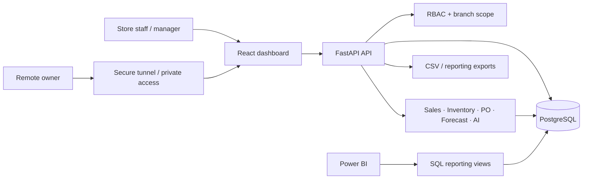

# Hybrid Retail Intelligence Platform

A full-stack retail operations and analytics system built for small and multi-branch businesses that need inventory control, sales visibility, purchase-order workflows, forecasting, and remote owner access without making a hosted cloud database the center of the architecture.

The platform combines **FastAPI, PostgreSQL, React, TypeScript, forecasting, AI-assisted analysis, and Power BI-ready reporting** in a local-first deployment model.

## At a Glance

| Area | Implementation |
| --- | --- |
| Backend | FastAPI, Python, SQLAlchemy |
| Database | PostgreSQL |
| Frontend | React, TypeScript, Vite |
| Migrations | Alembic |
| Analytics | Recharts, SQL reporting views, CSV exports |
| Forecasting | Explainable moving-average and trend-based demand forecasts |
| AI | Database-backed business assistant with controlled tools |
| BI | Power BI support |
| Access | Role-based authentication and branch scope |
| Deployment model | Local-first with optional secure remote access |

## Problem

Many small retail businesses still manage stock, purchases, sales, and reporting through disconnected spreadsheets or manual checks. That creates several recurring problems:

- stockouts and delayed reordering;
- weak visibility across branches;
- manual purchase-order follow-up;
- inconsistent sales reporting;
- poor remote visibility for owners;
- unnecessary infrastructure cost for businesses that do not need a fully cloud-native stack.

This project approaches that problem as an operational system rather than a dashboard-only prototype.

## Core Capabilities

### Retail operations

- Product, category, supplier, and branch management
- Inventory tracking and low-stock detection
- Manual stock adjustments with reasons
- Stock-movement ledger
- Multi-item sales entry with server-side totals
- Inventory reduction after completed sales
- Purchase-order lifecycle from draft through receiving
- Branch-aware role permissions

### Decision support

- Sales KPIs and trend dashboards
- Gross-profit and branch-performance views
- Top-product and slow-moving-stock analysis
- Reorder recommendations using current stock, target stock, sales velocity, and supplier lead time
- 7, 30, and 90-day forecasting where sufficient data exists

### AI-assisted analysis

The assistant is designed to answer business questions using backend data tools instead of inventing operational values.

Example questions include:

- Which products are low in stock?
- What should be reordered today?
- What are the top-selling products this month?
- Which branch is performing best?
- Which products are slow-moving?
- What purchase orders are still pending?
- What is next week's demand forecast?

The core data flow still works without an external model key.

## Architecture



The browser never connects directly to PostgreSQL.

For the detailed system design, see [docs/ARCHITECTURE.md](docs/ARCHITECTURE.md).

## Important Business Rules

The backend enforces operational rules rather than relying on frontend state:

- Sales reduce inventory.
- Creating a purchase order does not increase available stock.
- Receiving a purchase order increases inventory.
- Every inventory change creates a stock-movement record.
- Manual adjustments require a reason.
- Reorder quantities cannot be negative.
- Dashboard metrics are calculated from backend/database data.
- AI numerical answers use backend tools.
- Role and branch permissions are enforced server-side.

## Repository Structure

```text
backend/    FastAPI API, domain logic, models, migrations, tests
frontend/   React + TypeScript application
docs/       Architecture, setup, QA, case study, demo and deployment docs
powerbi/    Reporting support assets
scripts/    Backup and restore utilities
```

## Run Locally

### 1. Backend

```bash
cd backend
python -m venv .venv
source .venv/bin/activate
pip install -r requirements.txt
cp ../.env.example .env
alembic upgrade head
python -m scripts.seed --reset
uvicorn app.main:app --reload
```

On Windows PowerShell, activate the environment with:

```powershell
.venv\Scripts\Activate.ps1
```

API health check:

```text
http://localhost:8000/api/health
```

### 2. Frontend

```bash
cd frontend
npm install
npm run dev
```

Open:

```text
http://localhost:5173
```

For the full setup path, see [docs/SETUP_GUIDE.md](docs/SETUP_GUIDE.md).

## Testing

Backend regression:

```bash
cd backend
python -m pytest -q
```

Frontend checks:

```bash
cd frontend
npm run typecheck
npm run build
```

The repository also contains workflow-level QA documentation in [docs/QA_CHECKLIST.md](docs/QA_CHECKLIST.md).

## Reporting

Power BI is treated as an executive reporting layer, while operational actions remain in the web application.

Reporting views include:

- `vw_sales_summary`
- `vw_sales_by_product`
- `vw_sales_by_category`
- `vw_inventory_health`
- `vw_low_stock`
- `vw_purchase_order_status`
- `vw_supplier_performance`
- `vw_forecast_summary`

See [docs/POWER_BI_SETUP.md](docs/POWER_BI_SETUP.md).

## Reliability and Remote Access

The database is intended to remain private. Remote users access the authenticated application rather than connecting directly to PostgreSQL.

The repository documents:

- Cloudflare Tunnel / private remote access options
- PostgreSQL backup and restore
- release verification
- security checks
- deployment boundaries

Relevant documents:

- [Remote Access](docs/REMOTE_ACCESS.md)
- [Backup & Restore](docs/BACKUP_RESTORE.md)
- [Final Verification](docs/FINAL_VERIFICATION.md)

## Engineering Decisions

A few deliberate choices in this project:

1. **Local-first data ownership**  
   The business can keep its primary operational database local while still providing controlled remote access.

2. **Backend-enforced business rules**  
   Inventory and purchase workflows are transactional domain behavior, not frontend-only calculations.

3. **Explainable forecasting first**  
   The initial forecasting layer favors understandable output and clear insufficient-data states over unnecessarily complex models.

4. **AI as an interface to verified data**  
   AI responses are grounded in backend tools instead of treating the model as a database.

5. **Operational application and BI remain separate**  
   Power BI supports executive analysis; transactional work stays in the application.

## Documentation

- [Architecture](docs/ARCHITECTURE.md)
- [Setup Guide](docs/SETUP_GUIDE.md)
- [Case Study](docs/CASE_STUDY.md)
- [Demo Script](docs/DEMO_SCRIPT.md)
- [QA Checklist](docs/QA_CHECKLIST.md)
- [Power BI Setup](docs/POWER_BI_SETUP.md)
- [Remote Access](docs/REMOTE_ACCESS.md)
- [Backup & Restore](docs/BACKUP_RESTORE.md)
- [Final Verification](docs/FINAL_VERIFICATION.md)

Product and technical planning documents are also retained in the repository for traceability.

## Current Status

The main retail MVP includes backend APIs, frontend workflows, PostgreSQL migrations, authentication and role controls, inventory and sales operations, purchase orders, dashboards, forecasting, AI-assisted analysis, reporting exports, backup documentation, and QA coverage.

Some broader multi-venture and cafe capabilities remain documented as planned expansion work rather than being presented as completed production functionality.

## Interview Summary

**Hybrid Retail Intelligence Platform** — built a local-first full-stack retail system using FastAPI, PostgreSQL, React and TypeScript with branch-aware RBAC, transactional inventory and sales workflows, purchase-order management, reorder recommendations, explainable forecasting, AI-assisted business analysis, Power BI reporting support, and documented backup/remote-access strategy.
