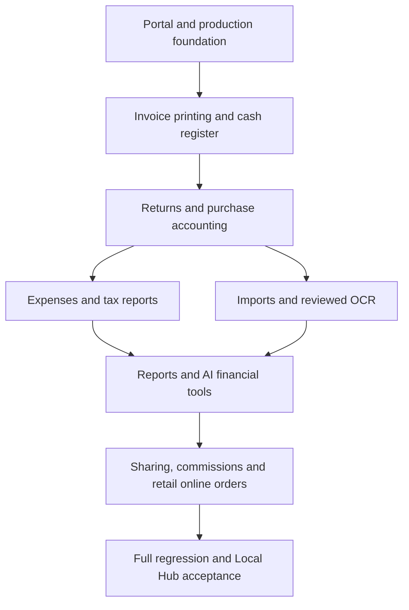

# Full product completion matrix

Reviewed 2026-09-20. Scope: `PRD_HITECH_COMPETITIVE_ADDONS.md`, `docs/HITECH_COMPETITIVE_EXPANSION_PLAN.md`, the multi-venture/cafe requirements and final Local Hub operating model. User selected the entire expansion roadmap. **Release decision: BLOCKED for that scope.**

The earlier cafe/core CI pass validates implemented behavior; it does not complete the older expansion roadmap. Configuration entities such as `PrintTemplate` and a credit-note sequence are not working print/return workflows. Governance reversals are not a complete item-level returns module.

| Phase | Existing implementation | Work and exit gate still required |
|---|---|---|
| 0–2 Foundation/business/tax configuration | Company scoping, roles, profiles, tax operation settings, migration chain | Real business onboarding and owner MFA on target; bootstrap added, host acceptance pending |
| 3 Catalog/barcodes | Products, tax/HSN fields, alternate barcode lookup and barcode services | Verify actual scanner and duplicates through bulk onboarding |
| 4 Customers/ledger | Customer records, opening balance, invoices and payment ledger | Full returns/credit-note reconciliation depends on phase 8 |
| 5 Invoice/POS | Server-side quoting, issue/payment, stock, partial/split/credit, cafe billing | Real browser workflow coverage and target hardware acceptance; entry-point routing fixed in this change |
| 6 Printing/PDF | Template configuration and limited existing invoice presentation | Dedicated A4/A5/58/80mm renderers, downloadable PDFs, credit/purchase templates, real printer proof |
| 7 Cash register | Invoice payments and daily cafe closing | Drawer sessions, opening float, cash-in/out, expected-versus-counted reconciliation and mode summaries |
| 8 Returns/refunds | Governance reversal foundation | Item-level sales returns, cumulative quantity limits, saleable/damaged handling, credit notes, original-tax reversal, refund/customer ledger integration |
| 9 Purchase accounting | Purchase orders and stock receiving | Purchase bills, supplier payable ledger/payments, purchase returns/debit notes; PO receiving must not double-count stock |
| 10 Expenses/accounting | Sales analytics | Expense categories/entries, cashbook, account ledger, receivables/payables and reconciled profit reports |
| 11 GST preparation | Stored invoice tax rows | Sales/purchase/HSN registers, B2B/B2C, outward and summary exports, missing-field validation; include returns and debit notes |
| 12 E-document adapters | No complete provider workflow | Validated draft payloads, manual identifiers, submission states/provider interface; credentials and live-provider acceptance when enabled |
| 13 Barcode labels | Barcode data and lookup | Batch label layout, variants/MRP, printable barcode sheets and physical scan verification |
| 14 Bulk onboarding | Operational CRUD and exports | Validated CSV imports for catalog/customers/suppliers/prices/barcodes/opening stock; row errors, duplicate policy, atomic stock movements |
| 15 Sharing/reminders | No complete outbound workflow | Email/WhatsApp sharing, SMS adapter, templates, delivery logs and outstanding reminders; explicit send action and provider configuration |
| 16 Reliability/Hub | Systemd units, backup timer, health script; bootstrap, preflight and safe Linux restore added | Target installation/reboot, second-copy policy, restore evidence, monitoring/backup status UI; optional encryption |
| 17 AI tools/OCR | Existing scoped assistant and analytics | Expanded financial tools and confirmed draft actions; photo/PDF extraction → human review → purchase draft → approval, with no automatic stock posting |
| 18 Report center | Existing dashboards, cafe reports and BI views | At least 30 meaningful reports with applicable filters, safe CSV exports and reconciled source totals |
| 19 Staff/commission | RBAC and staff users | Staff profiles, shifts, commission rules and explainable/reconciled sales attribution |
| 20 Online store | Cafe QR cloud ordering | Retail public catalog/order requests, staff approval/rejection and conversion through authoritative invoice/stock flow |
| 21 Packaging/QA | CI backend/security/sync gates and mocked browser smoke | Real service/browser end-to-end suite, full expansion regression, demo scenarios, screenshots and completed target acceptance |

## Dependency flow

## Gate rules

1. Each monetary write requires server-side Decimal calculations, authorization, branch/company isolation, an audit trail and duplicate/concurrency tests.
2. Return quantities cannot exceed sold quantities, including prior returns. Damaged goods cannot replenish saleable stock. Original stored tax values drive reversals.
3. Purchase bills must distinguish unreceived goods from previously received PO stock. Financial posting and stock movements must be atomic.
4. Imports/OCR/AI must present reviewable drafts and require explicit approval before changing accounting or stock.
5. A module is complete only when its API, reachable UI, migration, scoped tests and user workflow pass. Empty pages, adapters without error handling, and mocked happy paths do not qualify.
6. Full release requires every applicable row plus the actual-Hub checklist in `LOCAL_HUB_GO_LIVE_RUNBOOK.md`. External provider and hardware gates cannot be certified from this workspace.

## Evidence for this continuation

- Main frontend now renders `PortalApp`, enabling cafe/super-admin role routing.
- Authenticated API client honors `VITE_OPERATIONAL_API_BASE_URL` before the legacy URL.
- Four browser regressions cover cafe admin, kitchen, order-taker and owner routing.
- Production bootstrap creates an isolated live business, refuses existing data, prompts for a strong owner password and requires subsequent MFA enrollment.
- Read-only preflight checks environment, schema heads, database role, business/MFA state and backup age/integrity; reports manual gates separately.
- Linux restore validates checksum, refuses nonempty targets and runs atomically; release CI invokes it and checks overwrite refusal.
- These changes do **not** mark phases 6–21 complete. Latest test results and remaining release blockers belong in the PR evidence.

### Additional findings resolved during real-browser verification

The real browser test exposed a kitchen-role authorization leak in legacy invoice routes. Router-level permission gates now also protect legacy sales, inventory, purchase, customer and master-data APIs. Regression tests verify kitchen denial, order-taker limits and analyst read access. Cafe billing now generates request IDs using `getRandomValues`, which supports LAN HTTP contexts where `randomUUID` is unavailable. Production sign-in no longer pre-fills demo credentials.

Local evidence: 243 backend tests passed with 19 PostgreSQL-specific skips before the additional route gate patch; the seven focused bootstrap/preflight/permission tests pass after it. Seven mocked browser checks pass. Two real browser-to-FastAPI/SQLite tests pass, including order → preparation → service → cash settlement → persisted stock deduction and kitchen financial-access denial. PostgreSQL CI and actual Hub/hardware acceptance are separate gates.
